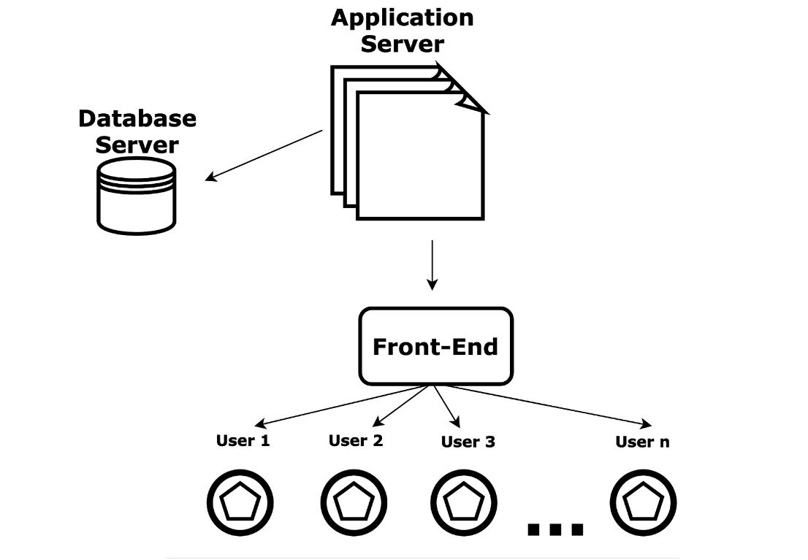

# Class 01: Getting started with HTML & CSS

### Client-server architecture

Client: The client refers to the user's device (such as a computer, tablet, or smartphone) that requests and displays web content. It interacts with the user directly through a web browser or application interface.

Server: The server is a remote computer that stores and processes data, files, and applications. It responds to client requests by providing requested resources, which could include web pages, images, videos, or other content.



### 🏗 Basic HTML Concepts

1. **What is HTML?**

   - **Definition and Purpose:** HTML stands for HyperText Markup Language. It is the standard language used to create web pages. HTML structures the content on the web.

2. **HTML Elements, Tags, and Attributes**

   - **HTML Elements:** The building blocks of HTML. An element typically consists of a start tag, content, and an end tag. Example: `<p>This is a paragraph.</p>`
   - **Tags:** The HTML code used to create elements. Tags are enclosed in angle brackets. Example: `<p>` for a paragraph.
   - **Attributes:** Provide additional information about elements. They are included in the opening tag and consist of a name and value. Example: ``

3. **HTML Document Structure**

   - **`<!DOCTYPE html>` Declaration:** This tells the browser that the document is an HTML5 document.
   - **Basic Structure:**
     - `<html>`: The root element that wraps all content.
     - `<head>`: Contains meta-information about the document (e.g., title, character set).
     - `<title>`: Sets the title of the web page, shown in the browser tab.
     - **Meta Tags:** Provide metadata such as character set, page description, and viewport settings. Example: `<meta charset="UTF-8">` sets the character encoding to UTF-8.
     - `<body>`: Contains the content of the document, such as text, images, and links.

4. **Basic HTML Tags**

   - **Headings:** `<h1>` to `<h6>` tags define headings, with `<h1>` being the most important and `<h6>` the least.
   - **Paragraph:** `<p>` tag is used to define a paragraph.
   - **Links:** `<a href="">` tag is used to create hyperlinks. `href` specifies the URL.
   - **Images:** `` tag is used to embed images. `src` specifies the image source, and `alt` provides alternative text.
   - **Lists:**
     - **Unordered List:** `<ul>` tag creates a bulleted list.
     - **Ordered List:** `<ol>` tag creates a numbered list.
     - **List Items:** `<li>` tag defines each item in a list.
   - **Line Breaks:** `<br>` tag inserts a line break.

5. **Attributes**

   - **Understanding Attributes:** Attributes provide additional information about HTML elements and are always included in the opening tag.
   - **Common Attributes:**
     - `href`: Specifies the URL in an `<a>` tag.
     - `src`: Specifies the image source in an `` tag.
     - `alt`: Provides alternative text for images.
     - `title`: Adds additional information about an element.
     - `id`: Uniquely identifies an element.
     - `class`: Specifies a class name for an element.

6. **Creating Links**

   - **Anchor Tag:** `<a href="">` is used to create links.
   - **External Links:** Links to other websites by setting `href` to an external URL.
   - **Internal Links:** Links to other pages within the same website by setting `href` to an internal URL.

7. **Adding Images**

   - **Image Tag:** `` is used to add images.
   - **`src` Attribute:** Specifies the path to the image file.
   - **`alt` Attribute:** Provides alternative text for the image, important for accessibility.

8. **Lists**

   - **Unordered Lists:** `<ul>` creates a bulleted list.
   - **Ordered Lists:** `<ol>` creates a numbered list.
   - **List Items:** `<li>` defines each item in the list.

9. **Basic Text Formatting**

   - **Bold Text:** `<b>` or `<strong>` makes text bold.
   - **Italic Text:** `<i>` or `<em>` makes text italic.
   - **Underlined Text:** `<u>` underlines text.

10. **Comments**

    - **Adding Comments:** `<!-- Comment -->` is used to add comments in the HTML code. Comments are ignored by the browser and do not appear on the web page.

11. **HTML Validation**
    - **Importance of Valid HTML:** Ensures that the web page is correctly displayed across different browsers.
    - **Using Validators:** Tools like the W3C Markup Validation Service can check HTML code for errors.

#### Extra Resources

- **W3Schools HTML Tutorial:** [W3Schools HTML](https://www.w3schools.com/html/)
  - Comprehensive tutorial covering all HTML elements, attributes, and best practices.
- **Mozilla Developer Network (MDN) HTML Guide:** [MDN HTML](https://developer.mozilla.org/en-US/docs/Web/HTML)
  - Detailed documentation and examples of HTML concepts, elements, and attributes.

### 🎨 Basic CSS Concepts

1. **What is CSS?**

   - **Definition and Purpose:** CSS stands for Cascading Style Sheets. It is used to style and layout web pages, including the design, color, and font.

2. **CSS Syntax**

   - **Selectors and Declarations:** CSS rules are made up of selectors and declarations. A selector points to the HTML element you want to style. A declaration block contains one or more declarations separated by semicolons.
     ```css
     p {
       color: red;
       font-size: 16px;
     }
     ```
     In this example, `p` is the selector, and `color: red;` and `font-size: 16px;` are declarations.

3. **Including CSS in HTML**

   - **Inline CSS:** Using the `style` attribute inside HTML elements.
     ```html
     <p style="color: red;">This is a red paragraph.</p>
     ```
   - **Internal CSS:** Using the `<style>` element inside the `<head>` section of an HTML document.
     ```html
     <head>
       <style>
         p {
           color: red;
         }
       </style>
     </head>
     ```
   - **External CSS:** Linking to an external CSS file using the `<link>` element.
     ```html
     <head>
       <link rel="stylesheet" href="styles.css" />
     </head>
     ```

4. **CSS Selectors**

   - **Element Selector:** Selects elements based on the element name. Example: `p` selects all `<p>` elements.
   - **Class Selector:** Selects elements based on the class attribute. Example: `.intro` selects all elements with class="intro".
   - **ID Selector:** Selects a single element based on the id attribute. Example: `#main` selects the element with id="main".
   - **Universal Selector:** Selects all elements. Example: `*`.
   - **Attribute Selector:** Selects elements based on an attribute or attribute value. Example: `[type="text"]` selects all `<input>` elements with type="text".

5. **CSS Properties**

   - **Color:** Sets the color of text. Example: `color: blue;`
   - **Background-Color:** Sets the background color of an element. Example: `background-color: yellow;`
   - **Font-Family:** Sets the font of text. Example: `font-family: Arial, sans-serif;`
   - **Font-Size:** Sets the size of text. Example: `font-size: 20px;`
   - **Text-Align:** Sets the horizontal alignment of text. Example: `text-align: center;`
   - **Margin:** Sets the space outside the border of an element. Example: `margin: 20px;`
   - **Padding:** Sets the space inside the border of an element. Example: `padding: 10px;`
   - **Border:** Sets the border of an element. Example: `border: 1px solid black;`

6. **The Box Model**

   - **Explanation:** The CSS box model describes the rectangular boxes that are generated for elements in the document tree and laid out according to the visual formatting model.
   - **Components:**
     - **Content:** The actual content of the element.
     - **Padding:** Clears an area around the content. The padding is transparent.
     - **Border:** A border that goes around the padding (if any) and content.
     - **Margin:** Clears an area outside the border. The margin is transparent.
   - **Example:**
     ```css
     div {
       width: 300px;
       padding: 20px;
       border: 10px solid black;
       margin: 30px;
     }
     ```

7. **CSS Layout Techniques**

   - **Display Property:** Controls the layout of an element. Common values are `block`, `inline`, `inline-block`, and `none`.
   - **Position Property:** Specifies the type of positioning method used for an element. Common values are `static`, `relative`, `absolute`, `fixed`, and `sticky`.

8. **CSS Colors**
   - **Color Names:** Use predefined color names. Example: `color: red;`
   - **Hexadecimal:** Use hex codes. Example: `color: #ff0000;`
   - **RGB:** Use rgb values. Example: `color: rgb(255, 0, 0);`
   - **HSL:** Use hsl values. Example: `color: hsl(0, 100%, 50%);`

#### Extra Resources

- **W3Schools CSS Tutorial:** [W3Schools CSS](https://www.w3schools.com/css/)

  - Comprehensive tutorial covering all CSS properties, selectors, and best practices.

- **Mozilla Developer Network (MDN) CSS Guide:** [MDN CSS](https://developer.mozilla.org/en-US/docs/Web/CSS)
  - Detailed documentation and examples of CSS concepts, properties, and selectors.
